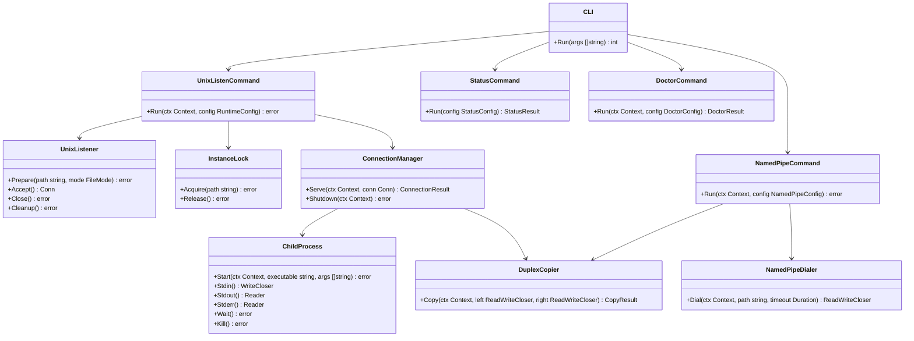
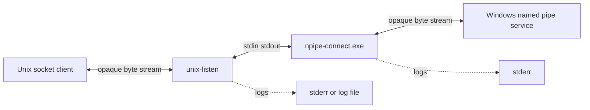
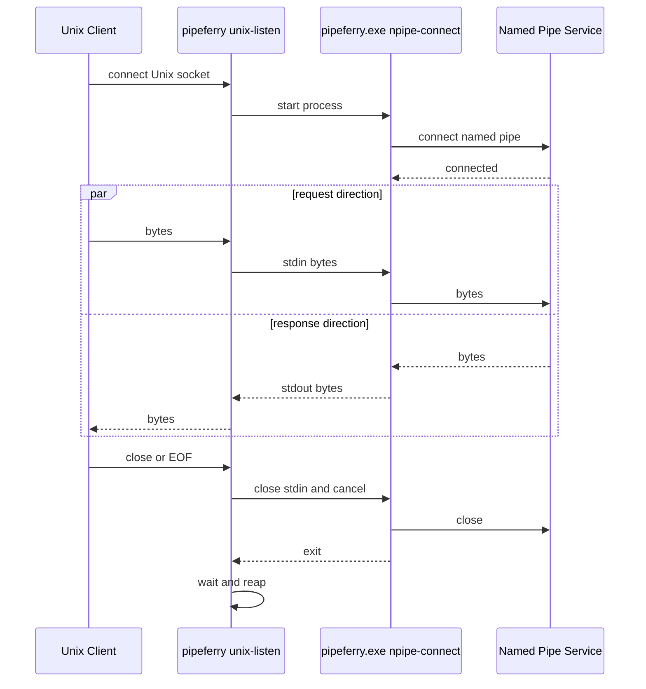
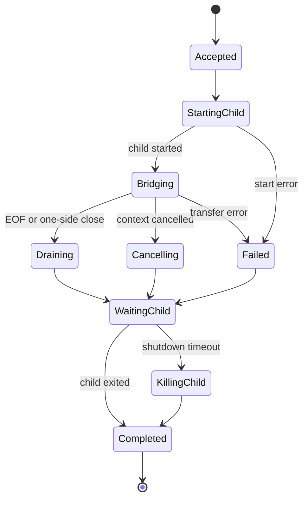

# Pipeferry Initial Implementation Plan

## 文書情報

| 項目 | 内容 |
|---|---|
| 計画書 | Pipeferry初期実装計画 |
| 計画書パス | `docs/plans/260720-s01-pipeferry-initial-implementation.md` |
| 要求仕様 | `docs/requirements/260720-pipeferry-requirements.md` |
| 対象リポジトリ | `masahide/pipeferry` |
| 作成日 | 2026-07-20 Asia Tokyo |
| 実装方針 | Prototype First、TDD、KISS、YAGNI |
| 対象環境 | Windows 11 x86-64、WSL2 Ubuntu x86-64 |
| 実装言語 | Go 1.25 |

## 1. 概要と目的 Overview and Purpose

### What

Pipeferryの初期バージョンとして、WSL2上のUnix Domain SocketとWindows上のNamed Pipeを、WSL相互運用機能と子プロセスの標準入出力を利用して双方向接続するCLIを実装する。

初期実装では同一ソースツリーから次の2つの実行形態を提供する。

- Linux側 `pipeferry unix-listen`
- Windows側 `pipeferry.exe npipe-connect`

Linux側はUnix Domain Socketへの接続ごとにWindows側プロセスを1つ起動する。Windows側は標準入出力と指定Named Pipeを透過的に中継する。

### Why

既存方式に含まれるPowerShell、Socat、独自多重化プロトコルへの依存を除去し、次の価値を得る。

- OS境界の責務をGo実装へ統一する
- 上位プロトコルを解析しない汎用ストリームブリッジとして独立利用できる
- 接続ごとに障害を分離し、終了処理と原因調査を単純化する
- Windows OpenSSH Agent、OmniSSHAgent、1Password SSH AgentなどをWSL2から利用できる
- 将来のインストーラー、自動起動、追加トランスポートの基盤を作る

### How

初期実装は一接続一プロセス方式とする。

```text
Unix socket client
        │
        ▼
pipeferry unix-listen
        │
        │ stdin and stdout
        ▼
pipeferry.exe npipe-connect
        │
        ▼
Windows named pipe service
```

設計上の中心は、OS非依存の双方向コピー、Linux固有のUnixソケットと子プロセス管理、Windows固有のNamed Pipe接続を明確に分離することである。

## 2. 仕様と受け入れ条件 Specification and Acceptance Criteria

### 2.1 スコープ Scope

#### 今回やること

- GoモジュールとCLIエントリーポイントの作成
- `pipeferry unix-listen`の実装
- `pipeferry.exe npipe-connect`の実装
- Unix Domain Socketの作成、権限制御、古いソケット判定
- 同一ソケットパスでの多重起動防止
- 接続ごとのWindows子プロセス起動
- Unixソケットと子プロセス標準入出力の双方向コピー
- 標準入出力とWindows Named Pipeの双方向コピー
- タイムアウト、キャンセル、シグナル、EOF、異常終了の契約実装
- `status`、`doctor`、`version`の最小実装
- Windows側`--check`の実装
- テキストログとJSONログの最小実装
- Unit、Integration、Contract、WSL E2Eテスト
- LinuxとWindowsのリリースバイナリ生成用GitHub Actions
- READMEとトラブルシューティングの更新

#### 成果物

```text
cmd/pipeferry/main.go
internal/buildinfo/
internal/cli/
internal/streamcopy/
internal/execbridge/
internal/unixsocket/
internal/namedpipe/
internal/diagnostic/
internal/logging/
docs/requirements/260720-pipeferry-requirements.md
docs/plans/260720-s01-pipeferry-initial-implementation.md
docs/troubleshooting.md
.github/workflows/ci.yml
.github/workflows/release.yml
README.md
```

#### 制約

- Linux側の正式対象はWSL2上のUbuntu x86-64とする
- Windows側の正式対象はWindows 11 x86-64とする
- LinuxバイナリはCGO無効でビルド可能にする
- Windows Named Pipeクライアントには`github.com/Microsoft/go-winio`を使用できる
- PowerShell、Socat、Python、Node.jsを実行時依存にしない
- TCP、UDP、HTTPを待ち受けない
- 転送データをログやファイルへ保存しない
- 標準出力は転送データ専用とし、ログを混入させない

### 2.2 非スコープ Non Scope

今回の初期実装では次を行わない。

- PowerShellワンライナーインストーラー
- 自動アップデート
- Windowsサービス化
- systemdユーザーサービス登録
- タスクトレイまたはGUI
- SSH秘密鍵の保存と管理
- SSH Agentプロトコルの解析
- 独自フレーミングまたは多重化プロトコル
- 単一Windowsプロセスへの複数接続集約
- TCP、UDP、TLSトランスポート
- WSL1、MSYS2、Cygwin対応
- ARM64の正式サポート
- Authenticode署名
- 接続先Named PipeのACL作成または変更

### 2.3 ユースケース Use Cases

#### UC-001 Windows OpenSSH AgentをWSL2から利用する

1. 利用者がWindows OpenSSH Agentを起動する
2. WSL2で`pipeferry unix-listen`を起動する
3. `SSH_AUTH_SOCK`へPipeferryのUnixソケットを設定する
4. `ssh-add -l`またはGit SSH認証を実行する
5. PipeferryがNamed Pipeへ透過的に要求を中継する

#### UC-002 任意のNamed PipeサービスをUnixソケットとして公開する

1. 利用者が`--pipe`でNamed Pipe名を指定する
2. 利用者が`--socket`でUnixソケットを指定する
3. Unixソケットクライアントが任意のバイナリデータを送受信する
4. Pipeferryは内容を解釈せず順序を保って転送する

#### UC-003 Named Pipeサービスが停止している

1. Unixソケットクライアントが接続する
2. Windows側プロセスがNamed Pipe接続を試行する
3. 既定5秒以内に接続失敗またはタイムアウトを返す
4. 当該Unix接続だけを終了する
5. Linux側リスナーは次の接続を待ち受け続ける

#### UC-004 Linux側リスナーを終了する

1. Linux側がSIGINTまたはSIGTERMを受信する
2. 新規接続受付を停止する
3. 稼働中接続をキャンセルする
4. 子プロセスを回収する
5. Unixソケットとロックファイルを削除する

#### UC-005 古いUnixソケットが残っている

1. 起動時に同名パスが存在する
2. 既存リスナーへ接続できない
3. 対象が現在ユーザー所有のUnixソケットであることを確認する
4. 古いソケットだけを削除して待ち受けを開始する
5. 通常ファイルやディレクトリの場合は削除せずエラー終了する

#### UC-006 32クライアントが同時接続する

1. 32接続をacceptする
2. 接続ごとに独立したWindows子プロセスを起動する
3. 一つの接続失敗が他接続へ影響しない
4. 全接続終了後に子プロセスとゴルーチンが残留しない

### 2.4 受け入れ条件 Acceptance Criteria

#### AC-001 UnixソケットからNamed Pipeへの双方向転送

Given テスト用Windows Named Pipeサーバーが起動している  
When WSL2のクライアントがPipeferryのUnixソケットへバイナリデータを送信する  
Then データが改変されずNamed Pipeへ届き、応答も改変されずUnixソケットへ返る

#### AC-002 SSH Agent互換性

Given Windows OpenSSH AgentまたはOmniSSHAgentに鍵が登録されている  
When `SSH_AUTH_SOCK`へPipeferryのUnixソケットを設定して`ssh-add -l`と`ssh-add -L`を実行する  
Then 鍵一覧と公開鍵を正常に取得できる

#### AC-003 接続障害の分離

Given Named Pipeサービスが停止している  
When Unixソケットクライアントが接続する  
Then 既定タイムアウト内に当該接続が終了し、Linux側リスナーは停止せず次の接続を受け付ける

#### AC-004 安全な終了

Given 複数接続とWindows子プロセスが稼働している  
When Linux側リスナーがSIGTERMを受信する  
Then shutdown timeout内に全接続と子プロセスが終了し、Unixソケットとロックファイルが残らない

#### AC-005 並行接続と資源回収

Given 32並列接続と100回の連続接続を実行する  
When 全接続が完了する  
Then データ破損がなく、プロセス、ファイルディスクリプタ、ゴルーチン数が継続的に増加しない

#### AC-006 標準出力の完全性

Given `pipeferry.exe npipe-connect`を通常動作させる  
When 情報ログ、警告、接続失敗が発生する  
Then 転送データ以外は標準出力へ出ず、診断情報は標準エラーだけへ出力される

#### AC-007 実行時依存の除去

Given クリーンなWindows 11とWSL2 Ubuntu環境がある  
When 配布バイナリを配置してPipeferryを起動する  
Then PowerShellスクリプト、Socat、Python、Node.jsを使用せずE2E通信が成立する

### 2.5 既知の制約 Known Limitations

- Unix接続ごとにWindowsプロセスを起動するため、短時間に大量接続する用途では起動コストが支配的になる可能性がある
- 標準入出力はストリームであり、上位プロトコルのメッセージ境界は保持も検証もしない
- WSL相互運用機能が無効な環境ではWindows実行ファイルを起動できない
- Pipeferry自身はNamed PipeサーバーのACLを強化しない
- Named Pipe側の半閉じ動作には制約があるため、片方向終了時は接続全体を終了する契約とする
- 初期バージョンでは自動常駐化を行わず、前面実行または外部プロセスマネージャーを利用する
- `doctor`のSSH Agent固有診断は汎用診断と分離し、`--ssh-agent`指定時だけ実行する

## 3. 前提技術スタック Context and Tech Stack

### Language and Runtime

- Go 1.25
- Linux amd64
- Windows amd64
- Windows 11
- WSL2 Ubuntu

### Libraries

- Go標準ライブラリ
- `github.com/Microsoft/go-winio` Named Pipeクライアント
- CLIパーサーは標準`flag.FlagSet`を使用する
- ロギングは標準`log/slog`を使用する
- テストは標準`testing`を中心に使用する
- 外部アサーションライブラリは導入しない

### Style Guide

- `gofmt`と`go vet`を必須とする
- OS固有コードは`_linux.go`、`_windows.go`とビルドタグで分離する
- パッケージ名は短い小文字とし、責務を一つに限定する
- 公開APIを最小化し、初期実装では可能な限り`internal`配下へ置く
- エラーは`fmt.Errorf`と`errors.Is`で分類可能にする
- エラー文は小文字で開始し、呼び出し元で文脈を付与する
- `context.Context`は第一引数とし、構造体へ保存しない

### Runtime and Deployment

- Linuxバイナリは`CGO_ENABLED=0`で生成する
- WindowsバイナリはネイティブWindowsバイナリとして生成する
- 同一タグからLinux版とWindows版を生成する
- 初期成果物はZIPまたはtar.gzとSHA-256 checksumとする

### Testing

- `go test ./...`
- Linuxでは`go test -race ./...`
- WindowsではNamed Pipe統合テストを実行する
- WSL E2EテストはWindowsセルフホストランナーまたは手動検証で実施する
- `go vet ./...`

## 4. インターフェース契約 Interface Contracts

### 4.1 公開APIまたは外部I O一覧

#### CLIルート

```text
pipeferry <command> [options]
```

初期コマンドは次のとおりとする。

```text
unix-listen     Linuxのみ
status          Linuxのみ
doctor          Linuxを主対象
npipe-connect   Windowsのみ
version         LinuxとWindows
```

`ensure`はプロセスのデーモン化方式を確定するまで初期必須から外す。初期リリースでは外部プロセスマネージャーまたはシェルのバックグラウンド実行を利用する。要求仕様上の`ensure`は後続計画へ移す。

#### Linux側CLI

```text
pipeferry unix-listen [options] -- <child executable> [child arguments...]
```

推奨例

```bash
pipeferry unix-listen \
  --socket "$XDG_RUNTIME_DIR/pipeferry/ssh-agent.sock" \
  --shutdown-timeout 5s \
  -- pipeferry.exe npipe-connect --pipe openssh-ssh-agent
```

子コマンドはシェル文字列として解釈しない。`--`以降を実行ファイルと引数配列として`exec.CommandContext`へ渡す。これによりシェル依存、クォート差異、コマンドインジェクションを避ける。

互換用環境変数`PIPEFERRY_EXEC`は初期実装では採用しない。環境変数だけで子コマンドを指定する要件は、引数配列を安全に表現できる設定形式を導入する後続フェーズで再検討する。

Linux側オプション

| オプション | 必須 | 既定値 | 契約 |
|---|---:|---|---|
| `--socket` | いいえ | XDG規則 | Unixソケットパス |
| `--socket-mode` | いいえ | `0600` | 8進表記 |
| `--shutdown-timeout` | いいえ | `5s` | 正のduration |
| `--max-connections` | いいえ | `32` | 1以上 |
| `--log-level` | いいえ | `info` | error warn info debug |
| `--log-format` | いいえ | `text` | text json |
| `--log-file` | いいえ | 未指定 | 未指定時stderr |

#### Windows側CLI

```text
pipeferry.exe npipe-connect --pipe <name> [options]
```

Windows側オプション

| オプション | 必須 | 既定値 | 契約 |
|---|---:|---|---|
| `--pipe` | はい | なし | 短縮名または完全パス |
| `--connect-timeout` | いいえ | `5s` | 正のduration |
| `--check` | いいえ | false | 接続後すぐ終了 |
| `--log-level` | いいえ | `info` | stderrのみ |

#### 状態確認

```text
pipeferry status --socket <path> [--json]
```

判定結果

- socket path exists
- path type
- connectable
- likely running
- stale
- permission

`status`はプロセス一覧に依存せず、Unixソケットへの接続可能性とロック状態を基準に判定する。

#### 診断

```text
pipeferry doctor [options] -- <child executable> [child arguments...]
```

診断項目

- WSL環境判定
- WSL相互運用機能
- Windows実行ファイル探索
- 子コマンド`--version`
- Windows側`npipe-connect --check`
- ソケット親ディレクトリの所有者と権限
- 任意のSSH Agent疎通確認

### 4.2 データモデルとスキーマ

#### RuntimeConfig

```go
type RuntimeConfig struct {
    SocketPath      string
    SocketMode      fs.FileMode
    ShutdownTimeout time.Duration
    MaxConnections  int
    ChildExecutable string
    ChildArgs       []string
    LogLevel        slog.Level
    LogFormat       string
    LogFile         string
}
```

#### NamedPipeConfig

```go
type NamedPipeConfig struct {
    PipePath        string
    ConnectTimeout  time.Duration
    CheckOnly       bool
    LogLevel        slog.Level
}
```

#### ConnectionResult

```go
type ConnectionResult struct {
    ID             string
    ChildPID       int
    StartedAt      time.Time
    EndedAt        time.Time
    BytesToChild   int64
    BytesFromChild int64
    Reason         EndReason
    Err            error
}
```

#### StatusResult

```go
type StatusResult struct {
    SocketPath string `json:"socketPath"`
    Exists     bool   `json:"exists"`
    IsSocket   bool   `json:"isSocket"`
    Connectable bool  `json:"connectable"`
    Locked     bool   `json:"locked"`
    Running    bool   `json:"running"`
    Stale      bool   `json:"stale"`
    Mode       string `json:"mode,omitempty"`
    Error      string `json:"error,omitempty"`
}
```

#### DoctorResult

```go
type DoctorResult struct {
    OK     bool          `json:"ok"`
    Checks []DoctorCheck `json:"checks"`
}

type DoctorCheck struct {
    Name    string `json:"name"`
    OK      bool   `json:"ok"`
    Detail  string `json:"detail,omitempty"`
    Error   string `json:"error,omitempty"`
}
```

### 4.3 エラーと例外 Error Handling

#### エラー分類

| 終了コード | 分類 | 例 |
|---:|---|---|
| 0 | 正常 | EOF、通常切断、`--check`成功 |
| 1 | internal | 想定外の内部エラー |
| 2 | usage | 引数不正、必須値不足 |
| 3 | not found | 子実行ファイル不在 |
| 4 | unix socket | bind、listen、権限設定失敗 |
| 5 | named pipe | Named Pipe接続失敗 |
| 6 | transfer | 読み書き失敗 |
| 7 | already running | 多重起動 |
| 8 | timeout | 接続または停止タイムアウト |
| 9 | diagnostic | doctor失敗 |

#### リトライ方針

- `unix-listen`は子プロセス起動やNamed Pipe接続を自動リトライしない
- 新しいUnixクライアント接続が次の独立した試行となる
- `npipe-connect`は`connect-timeout`内でgo-winioが提供する待機を利用する
- 指数バックオフや永続リトライは初期実装へ入れない

#### タイムアウト方針

- Named Pipe接続は既定5秒
- Linux側停止処理は既定5秒
- graceful shutdownを超えた子プロセスは強制終了する
- 通常のデータ転送にはアイドルタイムアウトを設けない

#### ログ方針

- Windows側stdoutは転送データ専用
- Windows側ログはstderr専用
- Linux側ログは既定stderr
- payload、鍵、署名対象、パスフレーズはログ禁止
- 子コマンド全体をログへ出す場合は将来の秘密引数混入を避け、実行ファイル名と安全なメタデータだけを既定出力する
- 接続IDはランダムな短い識別子とする

#### EOFと半閉じの契約

- UnixクライアントからEOFを受けたら子stdinを閉じる
- Windows側stdin EOFを受けたらNamed Pipeを閉じる
- Named Pipe側からEOFまたはbroken pipeを受けたらWindowsプロセスを終了する
- 片方向終了後、反対方向を無期限に待たない
- 正常なクライアント切断に由来するEOF、closed network connection、broken pipeはログレベルdebugとし、接続単位では正常終了として扱う

### 4.4 代表的な例 Examples

#### Windows OpenSSH Agent

```bash
pipeferry unix-listen \
  --socket "${XDG_RUNTIME_DIR}/pipeferry/ssh-agent.sock" \
  -- pipeferry.exe npipe-connect \
       --pipe openssh-ssh-agent \
       --connect-timeout 5s

export SSH_AUTH_SOCK="${XDG_RUNTIME_DIR}/pipeferry/ssh-agent.sock"
ssh-add -l
```

#### 完全なNamed Pipeパス

```bash
pipeferry unix-listen \
  --socket "$HOME/.local/run/example/service.sock" \
  -- /mnt/c/Tools/pipeferry.exe npipe-connect \
       --pipe '\\.\pipe\example-service'
```

#### 診断

```bash
pipeferry doctor --json -- \
  pipeferry.exe npipe-connect --pipe openssh-ssh-agent
```

## 5. アーキテクチャと設計図 Architecture and Diagrams

### 5.1 図の選択方針

本実装はLinux、Windows、Unix Domain Socket、標準入出力、Named Pipeという複数境界を跨ぐ。責務分離が重要であり、クラス図とシーケンス図を必須とする。終了処理は状態依存のため状態遷移図も追加する。

### 5.2 クラス図 Class Diagram



### 5.3 コンポーネント図 Component Diagram



### 5.4 正常接続シーケンス Sequence Diagram



### 5.5 接続状態遷移 State Diagram



## 6. テスト戦略 Test Strategy

### 6.1 テストの種類

#### Unit

OS非依存ロジックを実物I Oから切り離してテストする。

- `streamcopy`
  - 双方向コピー
  - 部分読み込みと部分書き込み
  - EOF伝播
  - コンテキストキャンセル
  - 一方のエラーによる全体停止
  - バイト数計測
  - ゴルーチン終了
- `cli`
  - サブコマンド選択
  - 引数バリデーション
  - durationとmode解析
  - 終了コード対応
- `namedpipe`
  - Pipe名正規化
  - 短縮名から完全パスへの変換
- `unixsocket`
  - 既定パス決定
  - パス種別判定
  - 古いソケット削除条件
- `logging`
  - stdoutへログしない構造
  - JSONログ形式

モック境界

- `net.Conn`
- `io.Reader`と`io.Writer`
- 子プロセス起動インターフェース
- Named Pipe Dialer
- ファイルシステム操作の限定的な関数境界

#### Integration

- Linux
  - 実Unix Domain Socket
  - テスト用echo子プロセス
  - flock
  - signal handling
  - 32並列接続
- Windows
  - go-winioによる実Named Pipeサーバーとクライアント
  - stdin stdoutを匿名パイプで接続
  - 接続タイムアウト
  - サーバー停止中と通信中断
- Cross process
  - `pipeferry unix-listen`からテスト用子バイナリを起動
  - 異常終了コードとstderr伝播

#### Contract

- CLIスナップショットではなく、引数と終了コードの表形式テストを作る
- Windows側stdoutに転送データ以外が混入しないことをバイト完全一致で検証する
- 短縮Named Pipe名の正規化結果を固定する
- JSON形式の`status`と`doctor`はフィールド名を契約テストする
- Unixソケットのmodeが`0600`、親ディレクトリが`0700`であることを実物で検証する

#### E2E

- Windows 11とWSL2上で実施する
- Windows OpenSSH Agentを第一のE2E対象とする
- `ssh-add -l`
- `ssh-add -L`
- 一時鍵とテスト用sshdまたはGitHub SSH接続による署名確認
- 100回連続接続
- 32並列接続
- 通信中SIGTERM
- Named Pipeサービス再起動

### 6.2 カバレッジ対象

重要ロジック

- 一方のコピー終了から全体終了までの制御
- 子プロセスのWaitと強制終了
- 古いソケットの安全な削除
- 多重起動防止
- 終了コード変換
- Named Pipe接続タイムアウト

エラー分岐

- 子プロセス未検出
- 子プロセス起動失敗
- Named Pipe不存在
- Unixソケットbind失敗
- ロック競合
- 通常ファイルとのパス競合
- client disconnect
- broken pipe
- shutdown timeout

境界条件

- 0バイト
- 1バイト
- バッファ境界前後
- 1MiB以上のバイナリ
- 32並列接続
- 100回連続接続
- 非ASCIIバイト列
- null byteを含むデータ

カバレッジ率を機械的な完了条件にはしない。`streamcopy`、`unixsocket`の安全判定、終了コード変換は主要分岐をすべてテストする。

## 7. 実装タスクリスト Implementation Plan

完了したタスクは計画書内のチェックボックスを`[x]`へ更新する。計画書更新が難しい場合は、PR説明へ完了Task IDを記載する。

### Phase 1 設計とリポジトリ初期化

- [ ] PLAN-001 要求仕様を`docs/requirements/260720-pipeferry-requirements.md`へ配置し、本文書から参照できる状態にする
- [ ] PLAN-002 CLI契約を確定する。子コマンドは`--`以降のargv配列とし、シェル文字列を使用しない
- [ ] PLAN-003 `ensure`と`PIPEFERRY_EXEC`を初期リリース非スコープへ移した差分を要求仕様へ反映する
- [ ] PLAN-004 終了コード、EOF、broken pipe、shutdown timeoutの契約を要求仕様とREADMEへ反映する
- [ ] PLAN-005 Mermaidのクラス図、シーケンス図、状態遷移図を確定する
- [ ] PLAN-006 `go mod init github.com/masahide/pipeferry`を実行する
- [ ] PLAN-007 `cmd/pipeferry`と`internal`の初期ディレクトリを作成する
- [ ] PLAN-008 `go-winio`依存を追加し、`go mod tidy`を実行する
- [ ] PLAN-009 Makefileまたは`Taskfile`を導入せず、初期はGoコマンドと小さなシェルスクリプトだけにする
- [ ] PLAN-010 CIの最小構成としてLinuxとWindowsの`go test`、`go vet`、ビルドを追加する

### Phase 2 CLI基盤とビルド情報

#### Red

- [ ] CLI-001 Test 未指定コマンド、未知コマンド、`--help`、`--version`の期待終了コードを作成する
- [ ] CLI-002 Test OS非対応サブコマンドのエラー契約を作成する
- [ ] CLI-003 Test duration、file mode、log level、log formatのバリデーションを作成する

#### Green

- [ ] CLI-004 Impl `cmd/pipeferry/main.go`を薄いエントリーポイントとして作成する
- [ ] CLI-005 Impl `internal/cli`へサブコマンドディスパッチと終了コード変換を実装する
- [ ] CLI-006 Impl `internal/buildinfo`へversion、commit、build date、GOOS、GOARCHを実装する
- [ ] CLI-007 Impl `version`と`--version`をLinuxとWindowsで動作させる

#### Refactor

- [ ] CLI-008 Refactor パースエラーと実行時エラーを型で分離する
- [ ] CLI-009 Refactor stdout、stderr、転送データWriterを依存注入し、テストで分離できるようにする
- [ ] CLI-010 Contract CLI終了コードの表形式テストを追加する

### Phase 3 OS非依存の双方向コピー

#### Red

- [ ] COPY-001 Test 両方向のバイト列が改変されないテストを作成する
- [ ] COPY-002 Test 部分読み込み、部分書き込み、0バイト、1MiBデータを作成する
- [ ] COPY-003 Test 一方向EOFで反対方向が終了するテストを作成する
- [ ] COPY-004 Test 読み書きエラーとcontext cancellationのテストを作成する
- [ ] COPY-005 Test コピー終了後にゴルーチンが残らないテストを作成する

#### Green

- [ ] COPY-006 Impl `internal/streamcopy`へ`DuplexCopier`を最小実装する
- [ ] COPY-007 Impl コピー結果へ双方向バイト数、終了理由、エラーを記録する
- [ ] COPY-008 Impl close関数を依存注入し、片方向終了時に接続全体を解除できるようにする

#### Refactor

- [ ] COPY-009 Refactor 正常EOFと異常エラーの分類を共通関数へ集約する
- [ ] COPY-010 Refactor すべての終了経路で一度だけcloseするよう`sync.Once`を適用する
- [ ] COPY-011 Contract stdoutへログを混入できないAPI境界をテストする

### Phase 4 Windows Named Pipeクライアント

#### Red

- [ ] WIN-001 Test `openssh-ssh-agent`と完全パスの正規化テストを作成する
- [ ] WIN-002 Test `--pipe`未指定、timeout不正、未知オプションのテストを作成する
- [ ] WIN-003 Test Named Pipe接続失敗とタイムアウトの終了コードを作成する
- [ ] WIN-004 Test stdinからNamed Pipe、Named Pipeからstdoutのバイト完全一致テストを作成する
- [ ] WIN-005 Test stderrへログを出してもstdoutが完全一致するテストを作成する
- [ ] WIN-006 Test `--check`が接続後に転送せず終了するテストを作成する

#### Green

- [ ] WIN-007 Impl `internal/namedpipe.NormalizePath`を実装する
- [ ] WIN-008 Impl `go-winio.DialPipeContext`相当のDialerラッパーを実装する
- [ ] WIN-009 Impl `npipe-connect`コマンドを実装する
- [ ] WIN-010 Impl stdin EOF、Named Pipe EOF、broken pipe時の終了処理を実装する
- [ ] WIN-011 Impl 設定エラー、接続失敗、timeout、転送失敗を終了コードへ変換する

#### Refactor

- [ ] WIN-012 Refactor Dialerをinterface化しUnitテストと実Named Pipe統合テストを分離する
- [ ] WIN-013 Refactor Windows固有エラーを`errors.Is`可能な内部エラーへ正規化する
- [ ] WIN-014 Integration 実Named Pipe echoサーバーを用いたWindowsテストを追加する
- [ ] WIN-015 Contract stdoutバイト完全一致テストをCIのWindowsジョブで実行する

### Phase 5 Linux Unix Domain Socket管理

#### Red

- [ ] UNIX-001 Test XDG、HOME、明示指定のソケットパス優先順位を作成する
- [ ] UNIX-002 Test 親ディレクトリ`0700`とソケット`0600`を作成する
- [ ] UNIX-003 Test 稼働中ソケット、古いソケット、通常ファイル、ディレクトリの判定を作成する
- [ ] UNIX-004 Test 自分以外が所有するソケットを削除しない安全契約を作成する
- [ ] UNIX-005 Test flockによる多重起動拒否を作成する

#### Green

- [ ] UNIX-006 Impl `internal/unixsocket.ResolvePath`を実装する
- [ ] UNIX-007 Impl 安全な親ディレクトリ作成とmode検証を実装する
- [ ] UNIX-008 Impl stale socket判定と削除を実装する
- [ ] UNIX-009 Impl socket path単位のロックファイルとflockを実装する
- [ ] UNIX-010 Impl listener close後のソケットとロックファイルcleanupを実装する

#### Refactor

- [ ] UNIX-011 Refactor ファイル種別、所有者、mode判定を独立した安全判定へ分離する
- [ ] UNIX-012 Integration 実Unix Domain Socketで多重起動とstale復旧を検証する
- [ ] UNIX-013 Contract 通常ファイルを削除しない回帰テストを追加する

### Phase 6 子プロセス管理と接続ライフサイクル

#### Red

- [ ] PROC-001 Test 接続ごとに子プロセスを1つ起動するテストを作成する
- [ ] PROC-002 Test 実行ファイル不在、起動失敗、異常終了のテストを作成する
- [ ] PROC-003 Test client disconnectでstdin close、Wait、必要時Killが行われるテストを作成する
- [ ] PROC-004 Test SIGTERMで全子プロセスがshutdown timeout内に終了するテストを作成する
- [ ] PROC-005 Test 一つの子プロセス失敗が他接続へ影響しないテストを作成する

#### Green

- [ ] PROC-006 Impl `internal/execbridge.ProcessFactory`を実装する
- [ ] PROC-007 Impl child stdin、stdout、stderr、Wait、Killを一つのライフサイクルとして管理する
- [ ] PROC-008 Impl stderrをLinux側loggerへ行単位またはサイズ制限付きで転送する
- [ ] PROC-009 Impl 接続IDとPIDを付与した接続ログを実装する
- [ ] PROC-010 Impl context cancellationとshutdown timeoutを実装する
- [ ] PROC-011 Impl semaphoreで`max-connections`を制御する

#### Refactor

- [ ] PROC-012 Refactor connection handlerを一接続の責務へ限定する
- [ ] PROC-013 Refactor WaitとKillの競合を`sync.Once`または状態管理で防ぐ
- [ ] PROC-014 Integration テスト用echo子バイナリで双方向転送を検証する
- [ ] PROC-015 Integration 32並列接続と100回連続接続を実行する

### Phase 7 `unix-listen`統合

#### Red

- [ ] LISTEN-001 Test 必須子コマンドなしでusage errorになるテストを作成する
- [ ] LISTEN-002 Test listener起動、accept、connection handler呼び出しを作成する
- [ ] LISTEN-003 Test SIGINT、SIGTERM、listener errorのテストを作成する
- [ ] LISTEN-004 Test shutdown timeout後の強制終了を作成する

#### Green

- [ ] LISTEN-005 Impl `unix-listen`コマンドへUnixListener、InstanceLock、ConnectionManagerを統合する
- [ ] LISTEN-006 Impl signal.NotifyContextによる停止を実装する
- [ ] LISTEN-007 Impl 新規accept停止、接続cancel、Wait、cleanupの停止順序を実装する
- [ ] LISTEN-008 Impl 起動時と終了時の構造化ログを実装する

#### Refactor

- [ ] LISTEN-009 Refactor cleanupを冪等化する
- [ ] LISTEN-010 Refactor 起動失敗途中でも作成済み資源を回収する
- [ ] LISTEN-011 Integration Unix socketからecho子プロセスまでのE2Eテストを追加する

### Phase 8 状態確認と診断

#### Red

- [ ] DIAG-001 Test `status`の不存在、稼働中、stale、通常ファイル判定を作成する
- [ ] DIAG-002 Test `status --json`の契約を作成する
- [ ] DIAG-003 Test `doctor`の各checkが独立して成功失敗を返すテストを作成する
- [ ] DIAG-004 Test 一部診断失敗時に残りの診断を継続するテストを作成する

#### Green

- [ ] DIAG-005 Impl `status`コマンドを実装する
- [ ] DIAG-006 Impl WSL判定、interop確認、子実行ファイル確認を実装する
- [ ] DIAG-007 Impl Windows側`--check`呼び出しを実装する
- [ ] DIAG-008 Impl `doctor --json`を実装する
- [ ] DIAG-009 Impl `--ssh-agent`指定時だけSSH Agent疎通確認を行う

#### Refactor

- [ ] DIAG-010 Refactor 診断項目を独立したCheckerとして追加可能にする
- [ ] DIAG-011 Contract JSONフィールド名と終了コード9を固定する
- [ ] DIAG-012 Docs READMEへ診断結果の読み方を追加する

### Phase 9 WindowsとWSLのE2E検証

- [ ] E2E-001 VERIFY Windows版とLinux版を同じcommitからビルドする
- [ ] E2E-002 VERIFY WSLから`pipeferry.exe --version`を実行できる
- [ ] E2E-003 VERIFY テスト用Named Pipeサーバーと任意バイナリを双方向転送する
- [ ] E2E-004 VERIFY Windows OpenSSH Agentで`ssh-add -l`が成功する
- [ ] E2E-005 VERIFY Windows OpenSSH Agentで`ssh-add -L`が成功する
- [ ] E2E-006 VERIFY 一時鍵を使用したSSH署名認証が成功する
- [ ] E2E-007 VERIFY Named Pipeサービス停止中もLinuxリスナーが継続する
- [ ] E2E-008 VERIFY 通信中にNamed Pipeサービスを停止して接続単位で回復する
- [ ] E2E-009 VERIFY 32並列接続を処理する
- [ ] E2E-010 VERIFY 100回連続接続後に残留Windowsプロセスがない
- [ ] E2E-011 VERIFY SIGTERM後にUnixソケット、ロック、子プロセスが残らない
- [ ] E2E-012 VERIFY PowerShell、Socat、Python、Node.jsを起動していないことを確認する
- [ ] E2E-013 BENCH Windows子プロセスの起動時間と一往復遅延のp50、p95、p99を記録する

### Phase 10 CI、リリース、ドキュメント

- [ ] REL-001 CI Linuxで`go test -race ./...`と`go vet ./...`を実行する
- [ ] REL-002 CI Windowsで`go test ./...`とNamed Pipe統合テストを実行する
- [ ] REL-003 CI Linux amd64とWindows amd64のビルドを検証する
- [ ] REL-004 Release タグから両OSの成果物とSHA-256 checksumを生成する
- [ ] REL-005 Release ldflagsでversion、commit、build dateを埋め込む
- [ ] REL-006 Docs READMEのコマンド例を実装済みCLIへ合わせる
- [ ] REL-007 Docs `docs/troubleshooting.md`へinterop、PATH、Named Pipe、stale socketの調査方法を追加する
- [ ] REL-008 Docs 要求仕様と計画書のチェックボックスを最終状態へ更新する
- [ ] REL-009 Security `govulncheck ./...`を実行し結果を記録する
- [ ] REL-010 Quality 不要なdebugログ、payload dump、実験コードを削除する

## 8. 完了の定義 Definition of Done

### 8.1 機能DoD Functional DoD

- [ ] AC-001からAC-007がすべて満たされている
- [ ] `pipeferry unix-listen`がWSL2で起動し、Unix Domain Socketを作成できる
- [ ] `pipeferry.exe npipe-connect`が指定Named Pipeへ接続できる
- [ ] 任意バイナリデータを改変せず双方向転送できる
- [ ] Windows OpenSSH Agentで鍵一覧、公開鍵取得、SSH署名が成功する
- [ ] Named Pipe障害が接続単位に分離される
- [ ] SIGTERMで全資源を回収できる
- [ ] 受け入れ条件と既知の制約がREADMEと要求仕様へ反映されている

### 8.2 品質DoD Quality DoD

- [ ] LinuxとWindowsの全テストがパスしている
- [ ] Linuxのrace detectorがパスしている
- [ ] `go vet ./...`がパスしている
- [ ] `gofmt -w`後に差分がない
- [ ] `govulncheck ./...`で未評価の重大脆弱性がない
- [ ] stdoutへログが混入しないContractテストがパスしている
- [ ] 通常ファイルをstale socketとして削除しないContractテストがパスしている
- [ ] 32並列と100回連続試験後に資源リークがない
- [ ] LinuxとWindows成果物のversionが一致する
- [ ] README、要求仕様、計画書、トラブルシューティングが実装と一致する
- [ ] 不要なデバッグコードとpayloadログが存在しない

## 9. 懸念事項と未確定事項 Concerns and Questions

### 9.1 子コマンド指定方式

要求仕様では`--exec`文字列と`PIPEFERRY_EXEC`が定義されているが、文字列を安全にargvへ分解するにはシェル依存または独自パーサーが必要になる。

本計画では次を推奨し、初期契約として採用する。

```text
pipeferry unix-listen [options] -- executable arg1 arg2
```

この変更を要求仕様へ反映してから実装を開始する。

### 9.2 `ensure`のデーモン化方式

`ensure`が未起動プロセスをバックグラウンド起動する場合、PID管理、ログ先、二重fork、WSL終了時挙動などを決める必要がある。初期ブリッジ本体の品質と独立した複雑さを持つため、初期リリースでは非スコープとする。

将来は次のどちらかを別計画で選ぶ。

- systemd user serviceを正式方式とする
- Pipeferry自身がbackgroundサブコマンドを提供する

### 9.3 半閉じの扱い

Windows Named Pipeと標準入出力ではUnix TCPのような一貫した半閉じを期待できない。初期実装では一方向の終了を接続全体の終了開始条件とする。

SSH Agentは要求応答型であり、この制約で主要ユースケースは満たせる見込みである。任意プロトコルで半閉じが必要なケースは既知の制約とする。

### 9.4 Windows子プロセスの孤児化

WSL側プロセスが強制終了した場合、Windowsプロセスがstdin EOFを速やかに受け取ることをE2Eで確認する必要がある。残留が確認された場合はWindows Job Objectまたは親監視を後続実装する。

Job Objectは初期実装へ先行導入せず、実測結果を判断基準とする。

### 9.5 `flock`とソケット接続確認の競合

多重起動防止はロックファイルを主契約とし、ソケット接続確認はstale判定の補助とする。起動途中の競合を避けるため、ロック取得後にソケット検査と作成を行う。

### 9.6 `doctor`の汎用性

Pipeferryは汎用ストリームブリッジであるため、SSH Agentメッセージ送信を既定診断に含めない。汎用診断はNamed Pipeへの接続確認までとし、SSH Agent診断は`--ssh-agent`オプションで明示的に有効化する。

### 9.7 WSL E2EのCI実行環境

GitHubホステッドランナーだけでWindowsとWSL2を跨ぐ完全E2Eを安定実行できるかを検証する必要がある。難しい場合は次の分担とする。

- GitHub Actions LinuxでUnitとUnix統合
- GitHub Actions WindowsでUnitとNamed Pipe統合
- WSL2 E2Eはセルフホストランナーまたはリリース前手動チェックリスト

E2Eが手動となる場合でも、コマンドと期待結果を`docs/e2e-checklist.md`へ固定する。

### 9.8 接続数上限時の挙動

`max-connections`到達時はaccept後に即切断するのではなく、semaphore取得までaccept処理を停止する方式を基本とする。ただしlisten backlogへの影響を負荷試験で確認する。

初期の契約は、上限到達時に既存接続を維持し、リスナー全体を停止しないこととする。

### 9.9 ログファイルのローテーション

要求仕様にはログファイル指定があるが、ローテーション実装はYAGNIの観点から初期スコープ外とする。初期はstderrを推奨し、`--log-file`利用時は単一ファイルへのappendのみとする。

長期常駐用途では外部プロセスマネージャーまたはログ収集基盤でローテーションする。

### 9.10 最初の実装順序

リスクの高い終了制御を最後にまとめて実装しない。次の順序で縦に動く最小経路を早期に完成させる。

1. Windows Named Pipe echo接続
2. OS非依存streamcopy
3. Linux Unixソケットとecho子プロセス
4. LinuxからWindows子プロセスを起動する最小E2E
5. 終了制御と資源回収を強化
6. status、doctor、CI、リリース

Phase 4からPhase 7の途中で、テスト用Named Pipeサービスを使用した最小WSL E2Eを一度実行する。設計上の前提が崩れている場合は、後続機能を進める前に修正する。
